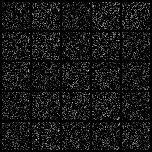
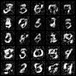
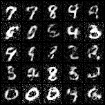

# mnist_gan
* 단순 MLP를 사용한 GAN으로 MNIST 숫자를 학습, 생성한다.
* pytorch를 사용, mnist dataset은 실행 시 다운로드한다.

* [Generative Adversarial Networks](https://arxiv.org/abs/1406.2661) 참고하여 작성.
***
* Discriminator : FC-LeakyReLU-FC-LeakyReLU-FC-Sigmoid
* Generator : FC-BatchNorm1d-ReLU-FC-BatchNorm1d-ReLU-FC-Tanh

* Loss ftn : Mean Squared Error
* Optimizer : Adam
***
* Discriminator : random Z값으로 fake, Real data 분별하게 학습
* Generator : random Z값으로 생성한 fake를 discriminator가 real로 판별하도록 학습

| epoch | result |
|:---:|:---:|
| 0 |  |
| 100 |  |
| 200 |  |